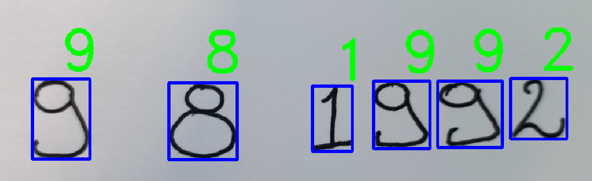
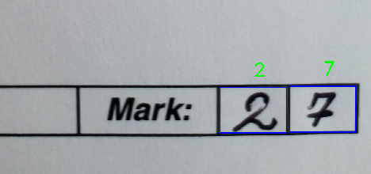
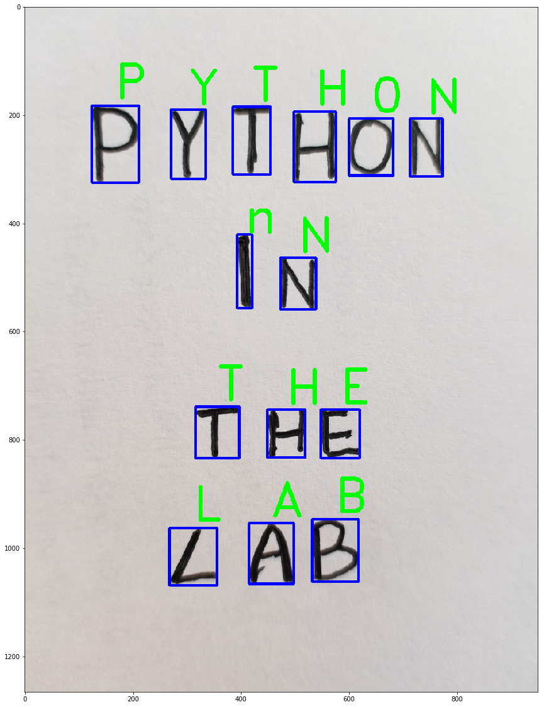

<h1 align="center"> ~ Handwritten Characters Recognizer with Deep Learning~ </h1>

What about training a very useful network at recognizing cats and dogs? Or better, what about training a nice CNN at recognnizing some beautiful handwritten digits as Yann LeCun did 25 years ago? Naturally, this is not cutting edge AI project, but it is really the A B C of modern machine learning. However, I made it for a Python class project and to impress my professor I use DEEP LEARNING! I din't want to publish this project because it's very too trivial and simple. However, after a GitHub search I realised that if it's very straightforward training a CNN on MNIST or Extended MNIST but it's not so simple, at least to many, use it to classify new samples written on a piece of paper. So, I thought that maybe someone could enjoy this repository. It's not limited only to digits, but the network can be easilly trained with a dataset that detects 46 symbols (letters & numbers).


# 1.0 Getting Started

It was a Python class project, so I had to be very precise in comments and documentation. For that reason, the project is very simple to use it and self-explanatory.

Start cloning this repository:

   ```bash
   git clone https://github.com/EscVM/Handwritten_Characters_Recognizer
   ```
   
than, start [jupyter](https://jupyter.org/) and open 'handwritten_recognizer.ipynb' file. There, you'll find all the information that you need. Enjoy ;)

# Examples

After, you have a trained network (I already uploaded my weights) these are some examples of what you can do:

- Predict digits on a plain white sheet:



- Predict digits in boxes with specified dimensions:



- Predict characters & digits on a plain white sheet:


